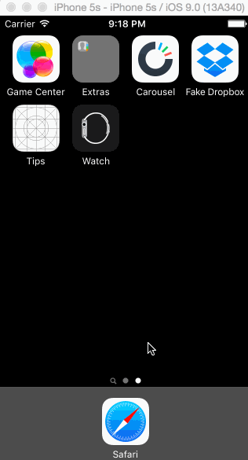

# Carousel
This is the Carousel prototype by Jeremy Chipman for the iOS for Designers and Product Managers class.

Time: I spent around 14 hours on the assignment. 

Required stories completed:

Static photo tiles on the initial screen

Sign In
Tapping on email/password reveals the keyboard and shifts the scrollview and Sign In button up.
Upon tapping the Sign In button:
If the username or password fields are empty, user sees an error alert.
If credentials are incorrect, user sees a loading indicator for 2 seconds followed by an error alert.
If the credentials are correct, user sees a loading indicator for 2 seconds followed by a transition to the Tutorial screens.

Tutorial Screens
User can page between the screens
Optional: User can page between the screens with updated dots
Optional: Upon reaching the 4th page, hide the dots and show the "Take Carousel for a Spin" button.

Image Timeline
Display a scrollable view of images.
User can tap on the conversations button to see the conversations screen (push).
User can tap on the profile image to see the settings view (modal from below).

Conversations
User can dismiss the conversations screen

Settings
User can dismiss the settings screen.
User can log out

